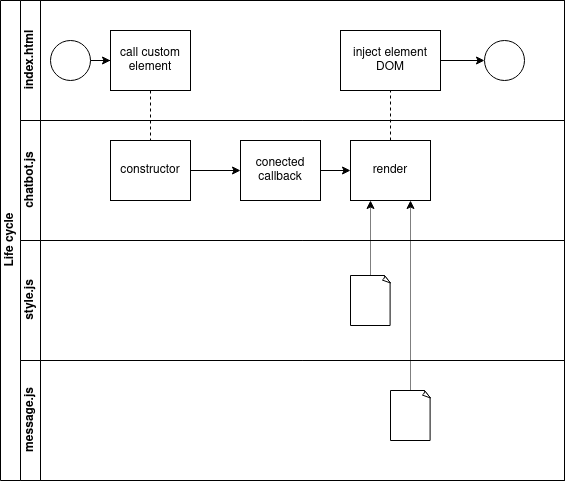
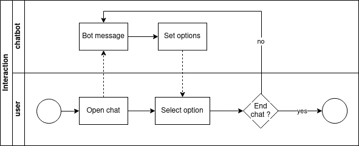
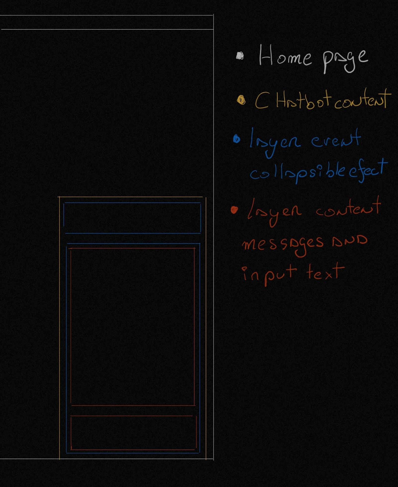

# 💬 webComponent-chatbot

> See the branch for more details

Why use custom elements? Because is easy use. You can implements and import components on all web pages and not generate bugs or affect in a project.

## 1.0 Version

- index.html
- style.css
- chatbot.js
- styles.js

### index.html

In this case, only call custom html element

```
<chatbot-component></chatbot-component>
```

> 💡 Its recommend use 2 words for custom element name because html have standar elements name with only one word

### style.css

For body html styles

```
html {
  scroll-behavior: smooth;
  font-family: Helvetica, sans-serif, Arial;
}

body {
  margin: 0 auto;
  background-color: #f2f2f2;
  display: flex;
  width: 100vw;
  height: 100vh;
}
```

### chatbot.js

Create for custom element and propertyes

- Life cycle
- Styles
- Html Desing

#### life cycle

<p align="center"></p>

<p align="center"></p>

#### styles

| 💡 Detallar mejor de que tratan los estilos y denominaciones de uso

Only problem with custom elements is the style declaration. Actualy dont have a native method for import css on js and parse to string on development runtime. For legitible code, separated styles on other js file and import for variables.

```
import { global_styles, chat_styles, message_styles } from "./style.js";
```

After use this variables on this custom element when call render function

```
class chatBot extends HTMLElement{

  static get styles() { return global_styles + chat_styles + message_styles; }

  ...

  render() {
   return `
    ${ chatBot.styles } ...`
  }

  ...

}
```

#### html desing

First show the layers for design event and location of parts this chat

<p align="center"></p>

This layers represent the content for html structure in custom element

```
<section class="chat__position">
  <button id="chat-button" type="button" class="collapsible">Chatbot webcomponent </button>
  <div class="chat__content_toogle">
    <div class="chat__content_body">
      <div id="chatbox" class="chat__messages">
        <p id="botLoadingMessage" class="botText"><span>Loading...</span></p>
      </div>
      <div class="chat__input_bar">
        <input id="textInput" class="chat__input" type="text" name="msg" placeholder="Message" />
        <span id="chat-icon" class="chat__icon">${ chatBot.iconSend }</span>
      </div>
      <div id="chat-scroll"></div>
    </div>
  </div>
</section>
```

> 💡 chat-scroll element in this html only help with scroll efect to botton with send message

#### chat logical flow


